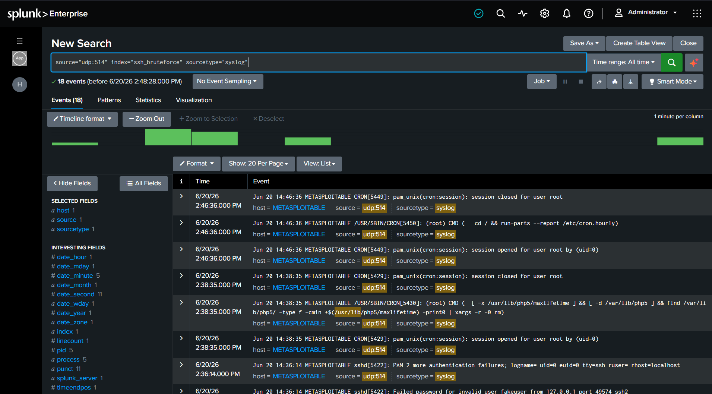
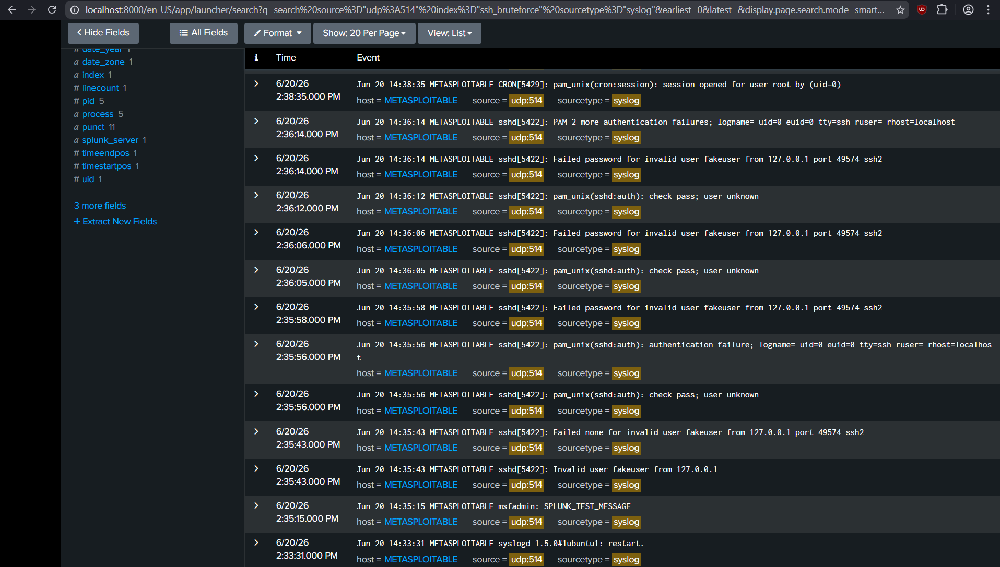
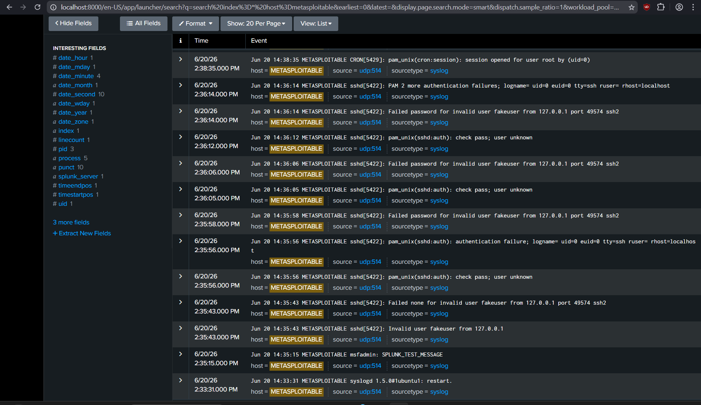
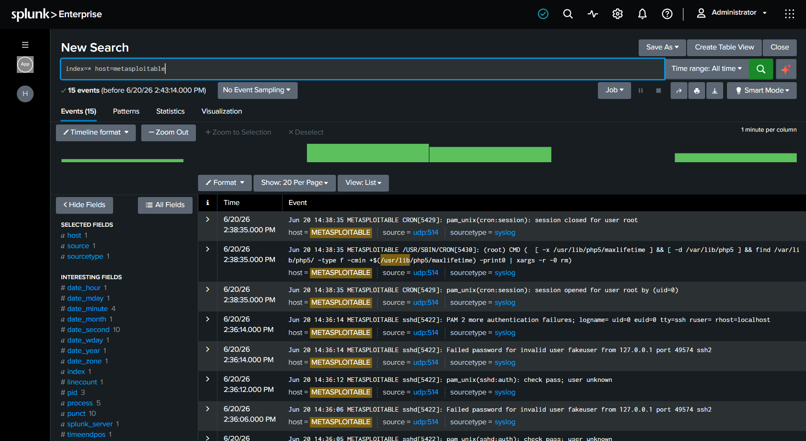
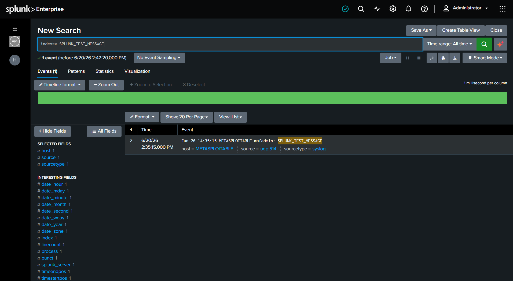
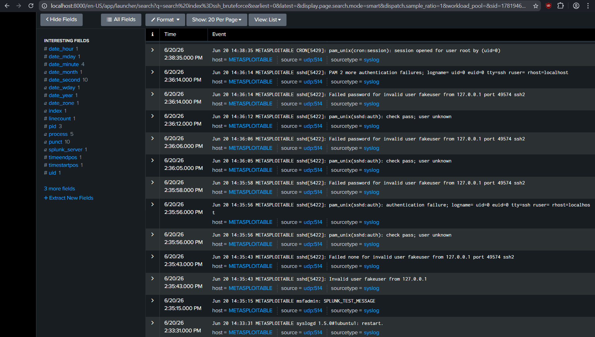
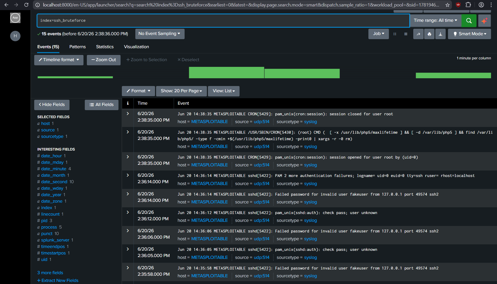

# SSH Brute-Force Attack Detection & Monitoring using Splunk

## Overview

This project demonstrates the detection and monitoring of SSH brute-force attacks using Splunk SIEM.

A vulnerable Metasploitable 2 machine forwards authentication logs to Splunk Enterprise through Syslog (UDP 514). Authentication failures generated during testing are collected, indexed, and analyzed using Splunk Search Processing Language (SPL).

The project showcases how security analysts can centralize logs, investigate failed login attempts, and build foundational SIEM detection workflows.

---

## Objectives

* Simulate SSH authentication failures in a controlled lab environment
* Configure Syslog-based log forwarding
* Ingest Linux authentication logs into Splunk
* Analyze authentication-related security events
* Build basic SIEM monitoring capabilities
* Demonstrate security event investigation using SPL queries

---

## Architecture

```text
Kali Linux (Attacker)
        |
        | SSH Login Attempts
        v
Metasploitable 2 (Target)
        |
        | Syslog Events
        v
UDP 514
        |
        v
Splunk Enterprise
        |
        v
Searches, Monitoring & Analysis
```

---

## Technologies Used

| Technology         | Purpose                      |
| ------------------ | ---------------------------- |
| Splunk Enterprise  | Log collection and analysis  |
| Kali Linux         | Attack simulation            |
| Metasploitable 2   | Vulnerable target system     |
| Syslog             | Log forwarding               |
| VMware Workstation | Virtualization platform      |
| Linux              | System administration        |
| SPL                | Security event investigation |

---

## Lab Environment

| Machine           | Role          |
| ----------------- | ------------- |
| Kali Linux        | Attacker      |
| Metasploitable 2  | Target        |
| Splunk Enterprise | SIEM Platform |

---

## Configuration

### Splunk Configuration

* UDP Input Port: 514
* Source Type: syslog
* Index: ssh_bruteforce

> Ready-to-deploy `.conf` files (input, field extractions, and the scheduled alert) are in
> [`splunk-config/`](splunk-config/). You can validate them against [`sample-data/`](sample-data/)
> without building the full lab.

### Metasploitable Configuration

Edit:

```bash
/etc/syslog.conf
```

Configure Syslog forwarding:

```bash
*.* @<SPLUNK_IP>
```

Restart Syslog service after configuration changes.

---

## Event Verification

Verify log ingestion using test messages and authentication-related events.

### View All Syslog Events

```spl
index=ssh_bruteforce sourcetype=syslog
```

### View Events From Metasploitable

```spl
host=METASPLOITABLE
```

### Search Authentication Failures

```spl
index=ssh_bruteforce "authentication failure"
```

### Search Failed Password Events

```spl
index=ssh_bruteforce "Failed password"
```

### Verify Test Message Ingestion

```spl
index=ssh_bruteforce SPLUNK_TEST_MESSAGE
```

---

## Project Workflow

1. Configure Syslog forwarding on Metasploitable.
2. Configure Splunk UDP input.
3. Verify log ingestion using test messages.
4. Generate authentication-related events.
5. Search and analyze events in Splunk.
6. Investigate authentication failures using SPL queries.

---

## Documentation

Detailed project documentation is organized into three folders:

**`docs/` — setup & methodology**

* [architecture.md](docs/architecture.md) — lab and data-flow architecture
* [lab-setup-and-commands.md](docs/lab-setup-and-commands.md) — full lab build and command reference
* [attack-simulation.md](docs/attack-simulation.md) — how the brute-force attack was simulated
* [splunk-searches.md](docs/splunk-searches.md) — SPL search reference
* [alerting.md](docs/alerting.md) — alert configuration

**`Detection-Rules/` — SIEM detection logic**

* [ssh-failed-password-detection.md](Detection-Rules/ssh-failed-password-detection.md)
* [brute-force-threshold-detection.md](Detection-Rules/brute-force-threshold-detection.md)
* [authentication-failure-detection.md](Detection-Rules/authentication-failure-detection.md)
* [invalid-user-detection.md](Detection-Rules/invalid-user-detection.md)
* [mitre-attack-mapping.md](Detection-Rules/mitre-attack-mapping.md) — MITRE ATT&CK mapping (T1110)

**`splunk-config/` — ready-to-deploy Splunk configs**

* [inputs.conf](splunk-config/inputs.conf) — UDP 514 Syslog input
* [props.conf](splunk-config/props.conf) — field extractions (`user`, `src_ip`, `src_port`)
* [savedsearches.conf](splunk-config/savedsearches.conf) — scheduled brute-force alert

**`sample-data/` — replicate without the VM lab**

* [auth.log](sample-data/auth.log) — sanitized sample `sshd` events ([how to load](sample-data/README.md))

**`Reports/` — analyst deliverables**

* [executive-summary.md](Reports/executive-summary.md)
* [incident-report.md](Reports/incident-report.md)
* [attack-timeline.md](Reports/attack-timeline.md)
* [lessons-learned.md](Reports/lessons-learned.md)

---

## Screenshots

### 1. Syslog Events Successfully Ingested



### 2. Additional Syslog Events



### 3. Metasploitable Host Search



### 4. Host Search Results



### 5. Splunk Test Message Verification



### 6. Authentication Failure Events



### 7. SSH Brute-Force Event Investigation



---

## Results

The project successfully demonstrated centralized log collection and security event monitoring using Splunk SIEM.

### Key Results

* Successfully configured Syslog forwarding from Metasploitable 2 to Splunk Enterprise.
* Verified ingestion of Linux authentication and system logs through UDP port 514.
* Generated and analyzed SSH authentication failure events.
* Indexed and searched security events using Splunk Search Processing Language (SPL).
* Demonstrated end-to-end SIEM workflow from log generation to investigation.

---

## Key Achievements

* Built a functional SIEM monitoring lab using VMware Workstation.
* Centralized Linux logs into Splunk using Syslog.
* Created SPL queries for security event investigation.
* Validated log visibility and searchability within Splunk.
* Documented architecture, workflows, and detection procedures.

---

## Sample SPL Queries

| Use Case                   | Query                                           |
| -------------------------- | ----------------------------------------------- |
| View All Syslog Events     | `index=ssh_bruteforce sourcetype=syslog`        |
| View Metasploitable Events | `host=METASPLOITABLE`                           |
| Authentication Failures    | `index=ssh_bruteforce "authentication failure"` |
| Failed Password Events     | `index=ssh_bruteforce "Failed password"`        |
| Test Message Verification  | `index=ssh_bruteforce SPLUNK_TEST_MESSAGE`      |

---

## Skills Demonstrated

* Security Information and Event Management (SIEM)
* Splunk Enterprise Administration
* Linux System Administration
* Syslog Configuration
* Log Collection and Management
* Security Event Analysis
* Search Processing Language (SPL)
* Incident Investigation
* Security Operations Center (SOC) Fundamentals

---

## Learning Outcomes

Through this project, I gained practical experience in:

* SIEM deployment and configuration
* Syslog-based log forwarding
* Splunk Enterprise administration
* SPL query development
* Linux authentication log analysis
* Security monitoring workflows
* Event investigation and troubleshooting
* SOC analyst fundamentals

---

## Repository Structure

```text
ssh-bruteforce-detection-splunk/
│
├── README.md
├── LICENSE
│
├── docs/
│   ├── architecture.md
│   ├── attack-simulation.md
│   ├── lab-setup-and-commands.md
│   ├── splunk-searches.md
│   └── alerting.md
│
├── Detection-Rules/
│   ├── ssh-failed-password-detection.md
│   ├── brute-force-threshold-detection.md
│   ├── authentication-failure-detection.md
│   ├── invalid-user-detection.md
│   └── mitre-attack-mapping.md
│
├── splunk-config/
│   ├── inputs.conf
│   ├── props.conf
│   └── savedsearches.conf
│
├── sample-data/
│   ├── auth.log
│   └── README.md
│
├── Reports/
│   ├── executive-summary.md
│   ├── incident-report.md
│   ├── attack-timeline.md
│   └── lessons-learned.md
│
└── screenshots/
    ├── 01-syslog-events-ingested.png
    ├── 02-syslog-events-ingested-alt.png
    ├── 03-host-metasploitable-search.png
    ├── 04-host-search-results.png
    ├── 05-splunk-test-message.png
    ├── 06-ssh-bruteforce-events.png
    └── 07-ssh-bruteforce-index-search.png
```

---

## Future Enhancements

* Real-time alerting
* Custom Splunk dashboards
* Correlation searches
* Threat intelligence enrichment
* Automated incident response workflows
* Detection rule tuning

---

## License

Released under the [MIT License](LICENSE).

---

## Author

**Bharathithasan S**

BE Computer Science and Engineering (Cyber Security)

GitHub: https://github.com/bharathi12-hub

Skills: Splunk • SIEM • Linux • Syslog • Security Monitoring • SOC
